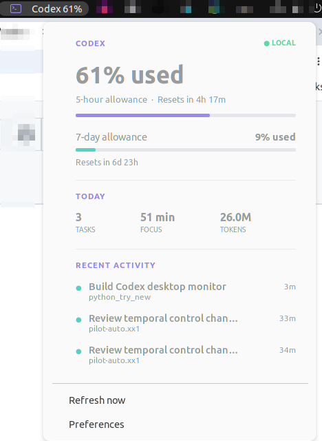

# Codex Usage Supervisor

[](https://github.com/Owen-Liuyuxuan/codex-usage-supervisor/actions/workflows/ci.yml)

A privacy-focused GNOME Shell addon for Ubuntu 22.04 that places current Codex
allowance and activity information in the top panel. The interface uses open
space, typography, slim progress lines, and frameless activity rows instead of
a traditional dashboard of boxed cards.



## Components

- **GNOME Shell 42 extension:** compact `Codex 37%` panel indicator and popover;
- **D-Bus service:** reads local metrics away from the GNOME Shell process;
- **Libadwaita preferences:** native controls for personal limits and refresh behavior;
- **Debian package:** installs and connects all three components.

See the [usage guide](docs/USAGE.md), [architecture](docs/ARCHITECTURE.md), and
[Cursor Enterprise monitoring design](docs/CURSOR_MONITORING.md) for details.

The service reads timestamps, task metadata, and numeric counters from
`~/.codex`. For allowance windows it asks the locally authenticated Codex
app-server for a fresh account snapshot, so usage from another computer can
appear without starting a local task. It does not manage an API key or
retain/display full prompt and response content, and it sends nothing to a
third-party service. Local token totals are activity estimates rather than
billing records.

## Build and install

```bash
git clone https://github.com/Owen-Liuyuxuan/codex-usage-supervisor.git
cd codex-usage-supervisor
./packaging/build_deb.sh
sudo apt install ./dist/codex-usage-supervisor_0.3.0_all.deb
systemctl --user daemon-reload
systemctl --user restart codex-usage-supervisor.service
```

GNOME Shell must discover the newly installed extension. On Ubuntu Wayland,
log out and sign in again; on Xorg, `Alt+F2`, then `r`, then Enter also reloads
the shell. Enable the addon afterward:

```bash
gnome-extensions enable codex-usage-supervisor@owen.local
```

The background service starts automatically through D-Bus when the extension
requests its first snapshot. Open **Codex Usage Supervisor Preferences** from
the application launcher, or run:

```bash
codex-usage-supervisor-preferences
```

The two `systemctl --user` commands are especially important during an
upgrade: reloading GNOME Shell does not restart an already-running D-Bus
backend.

## Development

Run one service snapshot:

```bash
PYTHONPATH=src python3 -m codex_usage_supervisor.service --once
```

Run the preferences interface:

```bash
PYTHONPATH=src python3 -m codex_usage_supervisor.preferences
```

Run tests:

```bash
PYTHONPATH=src python3 -m unittest discover -s tests -v
```

The D-Bus interface is `io.github.owen.CodexUsageSupervisor` at
`/io/github/owen/CodexUsageSupervisor`. It publishes `GetSummary`, `Refresh`,
and the `UsageChanged` signal. The GNOME Shell process never parses Codex logs.

## Remove

```bash
gnome-extensions disable codex-usage-supervisor@owen.local
sudo apt remove codex-usage-supervisor
```

Personal settings remain in
`~/.config/codex-usage-supervisor/settings.json` unless removed manually.
