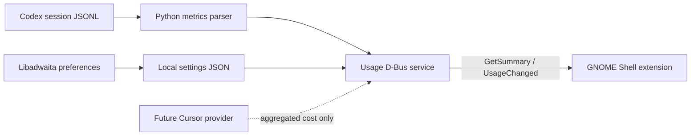

# Architecture

Codex Usage Supervisor separates untrusted and potentially expensive file
processing from GNOME Shell's UI process.

## Components

### Metrics parser

`src/codex_usage_supervisor/metrics.py` scans active and archived session logs.
It retains timestamps, identifiers, project paths, model names, turn IDs, and
numeric usage counters. Cumulative token counters are reduced to daily deltas.
Concurrent task events are merged when estimating focus time.

### D-Bus service

`src/codex_usage_supervisor/service.py` owns
`io.github.owen.CodexUsageSupervisor` on the user session bus. It exposes:

- `GetSummary() -> JSON string`
- `Refresh() -> JSON string`
- `UsageChanged(JSON string)`

The stable JSON contract contains aggregate values and at most five recent task
summaries. Full prompt and response bodies are excluded.

### GNOME extension

`extension/extension.js` renders the panel indicator and popover. It only calls
D-Bus asynchronously. It performs no filesystem or network I/O.

### Preferences

`src/codex_usage_supervisor/preferences.py` uses GTK4 and Libadwaita. Settings
are written atomically to the user's XDG configuration directory.

## Packaging lifecycle

The `.deb` installs the extension system-wide, registers a session D-Bus
activation service, and installs an optional systemd user unit. D-Bus starts the
backend when the extension requests its first snapshot.

