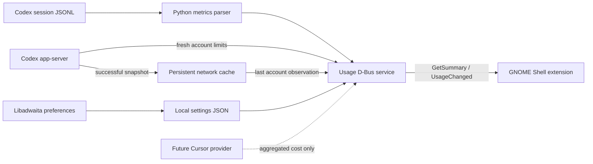

# Architecture

Codex Usage Supervisor separates untrusted and potentially expensive file
processing from GNOME Shell's UI process.

```mermaid
flowchart LR
    A["Codex session JSONL"] --> B["Python metrics parser"]
    B --> C["Usage D-Bus service"]
    H["Codex app-server"] -->|"fresh account limits"| C
    H -->|"successful snapshot"| I["Persistent network cache"]
    I -->|"last account observation"| C
    C -->|"GetSummary / UsageChanged"| D["GNOME Shell extension"]
    E["Libadwaita preferences"] --> F["Local settings JSON"]
    F --> C
    G["Future Cursor provider"] -. "aggregated cost only" .-> C
```

## Components

### Metrics parser

`src/codex_usage_supervisor/metrics.py` scans active and archived session logs.
It retains timestamps, identifiers, project paths, model names, turn IDs, and
numeric usage counters. Cumulative token counters are reduced to daily deltas.
Concurrent task events are merged when estimating focus time.

### D-Bus service

`src/codex_usage_supervisor/service.py` owns
`io.github.owen.CodexUsageSupervisor` on the user session bus. It exposes:

- `GetSummary() -> JSON string`
- `Refresh() -> JSON string`
- `UsageChanged(JSON string)`

The stable JSON contract contains aggregate values and at most five recent task
summaries. Full prompt and response bodies are excluded.

`src/codex_usage_supervisor/account.py` starts a short-lived, locally
authenticated Codex app-server and calls `account/rateLimits/read`. This is the
live allowance source. Successful account snapshots are atomically persisted by
`src/codex_usage_supervisor/network_cache.py`, separately from Codex's session
metadata. The service selects the snapshot with the newest `observed_at` across
the live account result, persistent network cache, and local session metadata.
On equal timestamps, live account data wins, then the network cache. An older
account response does not overwrite a newer network cache.

An offline refresh or service restart preserves the last network observation;
reading a cache never updates its observation timestamp. Newer local metadata
can still win, and a lower percentage after an allowance reset is accepted if
its snapshot is newer. Windows and GNOME clients share this selection policy.

Cache files contain only allowance windows, plan type, and observation time.
They live under `$XDG_CACHE_HOME/codex-usage-supervisor` (default
`~/.cache/codex-usage-supervisor`) on Linux, or
`%LOCALAPPDATA%/codex-usage-supervisor` on Windows. Each resolved Codex home has
a separate hashed filename. Missing or corrupt caches are ignored; write errors
are reported as `rate_limits_cache_error` without hiding a successful live result.
The source is published as `app-server`, `network-cache`, or `local-session`;
account refresh failures remain available in `rate_limits_refresh_error`.

### GNOME extension

`extension/extension.js` renders the panel indicator and popover. It only calls
D-Bus asynchronously. It performs no filesystem or network I/O.

### Preferences

`src/codex_usage_supervisor/preferences.py` uses GTK4 and Libadwaita. Settings
are written atomically to the user's XDG configuration directory.

## Packaging lifecycle

The `.deb` installs the extension system-wide, registers a session D-Bus
activation service, and installs an optional systemd user unit. D-Bus starts the
backend when the extension requests its first snapshot.
