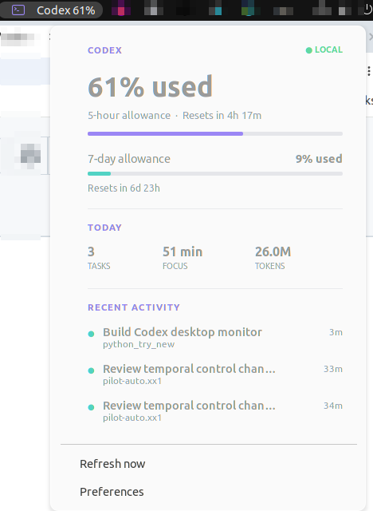

# Usage guide

## Where the visualization lives

The application launcher opens **preferences only**. The live visualization is
the `Codex <percent>%` indicator in the upper-right GNOME panel.



After installing the package, GNOME Shell must discover the extension. On X11:

1. Press `Alt+F2`.
2. Enter `r` and press Enter.
3. Enable the extension:

   ```bash
   gnome-extensions enable codex-usage-supervisor@owen.local
   ```

On Wayland, log out and sign in again before enabling it.

When upgrading an existing installation, also reload and restart the separate
user service:

```bash
systemctl --user daemon-reload
systemctl --user restart codex-usage-supervisor.service
```

Restarting GNOME Shell alone does not replace an already-running backend
process.

Click the panel indicator to see:

- current short-window allowance usage and reset countdown;
- current long-window allowance usage;
- today's tasks, estimated focus time, and local token count;
- the three most recently active tasks.

The allowance values are refreshed from the signed-in Codex account through
the local Codex app-server. Successful account results are saved in a separate
network cache that survives restarts. The newest observation wins across the
live account result, the network cache, and local session metadata. A temporary
connection failure therefore keeps the network snapshot unless local data is
newer. The popover displays `ACCOUNT` for a live result, `NETWORK CACHE` for a
saved account result, and `LOCAL CACHE` for local session metadata. Token and
focus-time figures remain local estimates, not official account billing
records.

Automatic refresh uses the interval in Preferences (30 seconds by default).
**Refresh now** requests a new account snapshot immediately; it does not start
or create a Codex task. Updates made on another computer can still take a short
time to reach the Codex backend.

## Preferences

Open **Codex Usage Supervisor Preferences** from the application launcher or run:

```bash
codex-usage-supervisor-preferences
```

Personal token and focus-time goals affect notifications; they do not change
Codex account limits. Changes are stored in
`~/.config/codex-usage-supervisor/settings.json`.

## Diagnostics

Check the extension state:

```bash
gnome-extensions info codex-usage-supervisor@owen.local
```

Request a backend snapshot:

```bash
gdbus call --session \
  --dest io.github.owen.CodexUsageSupervisor \
  --object-path /io/github/owen/CodexUsageSupervisor \
  --method io.github.owen.CodexUsageSupervisor.GetSummary
```

Inspect service or extension errors:

```bash
systemctl --user status codex-usage-supervisor.service
journalctl --user -b | grep -i codex-usage
```

If the popover stays on `LOCAL CACHE` immediately after an upgrade, restart
the user service as shown above and press **Refresh now** again.
